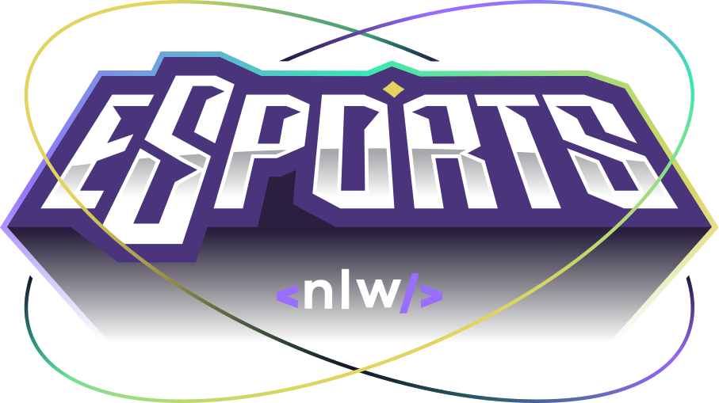

<a name="readme-top"></a>

[![MIT License][license-shield]][license-url] [![LinkedIn][linkedin-shield]][linkedin-url]

<!-- PROJECT LOGO -->
<br />
<div align="center">
  <a href="https://github.com/LeAmSa/nlw-esports-web">
    
  </a>

  <h3 align="center">NLW ESports</h3>
  <h4 align="center">Status: DONE ✅ </h4>
  <div align="center">
  <a href="https://findyourduomatch.vercel.app/" target="_blank">
	   🚀 Access the website on vercel
  </a>
  </div>
</div>

<br>

<!-- TABLE OF CONTENTS -->
<details>
  <summary>Table of Contents</summary>
  <ol>
    <li>
      <a href="#about-the-project">About The Project</a>
      <ul>
        <li><a href="#built-with">Built With</a></li>
      </ul>
    </li>
    <li>
      <a href="#getting-started">Getting Started</a>
      <ul>
        <li><a href="#prerequisites">Prerequisites</a></li>
        <li><a href="#installation">Installation</a></li>
        <li><a href="#settingapi">Setting API server</a></li>
        <li><a href="#running">Running the application</a></li>
      </ul>
    </li>
    <li><a href="#features">Features</a></li>
    <li><a href="#license">License</a></li>
    <li><a href="#acknowledgments">Acknowledgments</a></li>
  </ol>
</details>

<!-- ABOUT THE PROJECT -->

## About The Project

<a name="about-the-project"></a>

![Screenshot][screenshot]

The objective was to develop a small social network of duos for games. The user can create your own ad or access a particular game page and find other users that published ads with information like nickname, game time, weekdays/time disponibility, and if they accept voice channel. By the end, the users can connect by copying the [discord](https://discord.com/) nickname.

_Project developed during the Next Level Week event from [Rockeatseat](https://www.rocketseat.com.br/)._

<p align="right">(<a href="#readme-top">back to top</a>)</p>

### Built With

<a name="built-with"></a>

This project was built with the following main frameworks/libraries.

- [![Vite][vite-badge]][vite-url]
- [![React][react.js]][react-url]
- [![Typescript][typescript-badge]][typescript-url]
- [![Tailwind][tailwindcss-badge]][tailwind-url]

<p align="right">(<a href="#readme-top">back to top</a>)</p>

<!-- GETTING STARTED -->

## Getting Started

<a name="getting-started"></a>

### Prerequisites

<a name="prerequisites"></a>

- Resources needed
  - [Git][git-url]
  - [Node.js][nodejs-url]
  - A code editor (ex: [Visual Studio Code][vscode-url])

### Installation

<a name="installation"></a>

1. Clone the repo
   ```sh
   git clone https://github.com/LeAmSa/nlw-esports-web.git
   ```
2. Enter the project folder
   ```sh
   cd nlw-esports-web
   ```
3. Install NPM packages
   ```sh
   npm install
   ```

### Setting API server

<a name="settingapi"></a>

1. The server API for this project is present in my other repo named [nlw-esports-api](https://github.com/LeAmSa/nlw-esports-api). Follow the installation steps to put the API on.

2. Create (in nlw-esports-web) a `.env` file and enter your API key like in `.env.example`
   ```js
   VITE_API_URL = "ENTER YOUR API";
   ```

### Running the application

<a name="running"></a>

- Run the application in dev mode
  ```sh
   npm run dev
  ```

<p align="right">(<a href="#readme-top">back to top</a>)</p>

<!-- Features -->

## Features

<a name="features"></a>

- [x] Duo ad registration for a specific game
  - [x] Form validation
- [x] Copy the user discord to clipboard by accessing the ads
- [x] Responsive

<p align="right">(<a href="#readme-top">back to top</a>)</p>

<!-- LICENSE -->

## License

<a name="license"></a>

Distributed under the MIT License. See `LICENSE.txt` for more information.

<p align="right">(<a href="#readme-top">back to top</a>)</p>

<!-- ACKNOWLEDGMENTS -->

## Acknowledgments

<a name="acknowledgments"></a>

Here are some useful resources/libraries used during the development.

- [React Hook Form][react-hook-form-url]
- [Radix UI][radix-url]
- [Phosphor Icons][phosphor-icons-url]
- [React Copy to clipboard][react-copy-to-clipboard-url]
- [React loader spinner][react-loader-spinner-url]
- [Swiper.js][swiperjs-url]

<p align="right">(<a href="#readme-top">back to top</a>)</p>

<!-- MARKDOWN LINKS & IMAGES -->
<!-- https://www.markdownguide.org/basic-syntax/#reference-style-links -->

[screenshot]: https://drive.google.com/uc?id=1Uz56R8OBLLuvDYe_SEhPrNLYVRX7kgqx
[license-shield]: https://img.shields.io/github/license/othneildrew/Best-README-Template.svg?style=for-the-badge
[license-url]: https://github.com/LeAmSa/nlw-esports-web/blob/main/LICENSE
[linkedin-shield]: https://img.shields.io/badge/-LinkedIn-black.svg?style=for-the-badge&logo=linkedin&colorB=555
[linkedin-url]: https://www.linkedin.com/in/leandroamorimsalles1994
[git-url]: https://git-scm.com/
[nodejs-url]: https://nodejs.org/en/
[vscode-url]: https://code.visualstudio.com/
[vite-badge]: https://img.shields.io/badge/Vite-646CFF?style=for-the-badge&logo=vite&logoColor=white
[vite-url]: https://vitejs.dev/
[react.js]: https://img.shields.io/badge/React-20232A?style=for-the-badge&logo=react&logoColor=61DAFB
[react-url]: https://reactjs.org/
[typescript-badge]: https://img.shields.io/badge/Typescript-3178C6?style=for-the-badge&logo=typescript&logoColor=white
[typescript-url]: https://www.typescriptlang.org/
[tailwindcss-badge]: https://img.shields.io/badge/Tailwind%20CSS-06B6D4?style=for-the-badge&logo=tailwind-css&logoColor=white
[tailwind-url]: https://tailwindcss.com/
[radix-url]: https://www.radix-ui.com/
[phosphor-icons-url]: https://phosphoricons.com/
[react-copy-to-clipboard-url]: https://www.npmjs.com/package/react-copy-to-clipboard
[react-hook-form-url]: https://react-hook-form.com/
[react-loader-spinner-url]: https://mhnpd.github.io/react-loader-spinner/
[swiperjs-url]: https://swiperjs.com/
